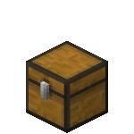
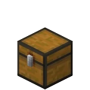
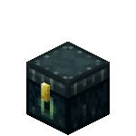
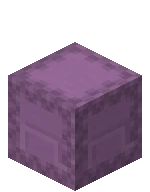

# SortContainer

Sort containers in one click.

Usage:

* Use command `/sort` to sort your inventory.

* Use `minecraft:spyglass` and `right click` on the container to sort it. Currently supported containers are as follows.

  * `minecraft:barrel`
  
  
  
  * `minecraft:chest`

  

  * `minecraft:trapped_chest`

  

  * `minecraft:ender_chest`

  

  * `minecraft:undyed_shulker_box`

  

  * `minecraft:shulker_box`

  
